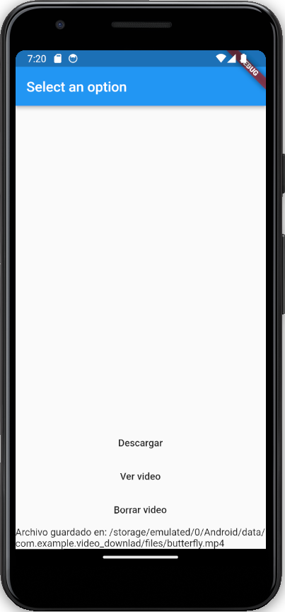

# Video Download

- Uso de Bases de Datos embebidas
- Uso de Provider
- Uso de http
- Uso de provider
- Guardar datos en el dispositivo
- Permisos de almacenamiento

# Lo que me costo mas trabajo

- Inicializar SQLite, tuve que agregar el metodo `WidgetsFlutterBinding.ensureInitialized()` porque generaba una excepcion de Services not inited
- En Android 13, ya no se necesita pedir permisos de almacenamiento, pero en versiones anteriores si, por lo que tuve que agregar un `if` para verificar la version de Android y pedir los permisos en caso de ser necesario

# Lo que aprendi

- El uso de Hive y SQLite en flutter
- El almacenamiento de datos en el dispositivo
- Pedir permisos de almacenamiento

# Screenshots

